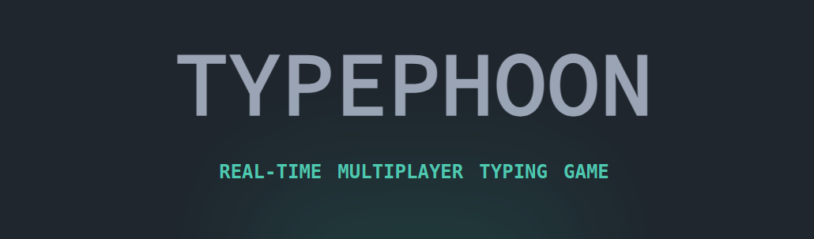
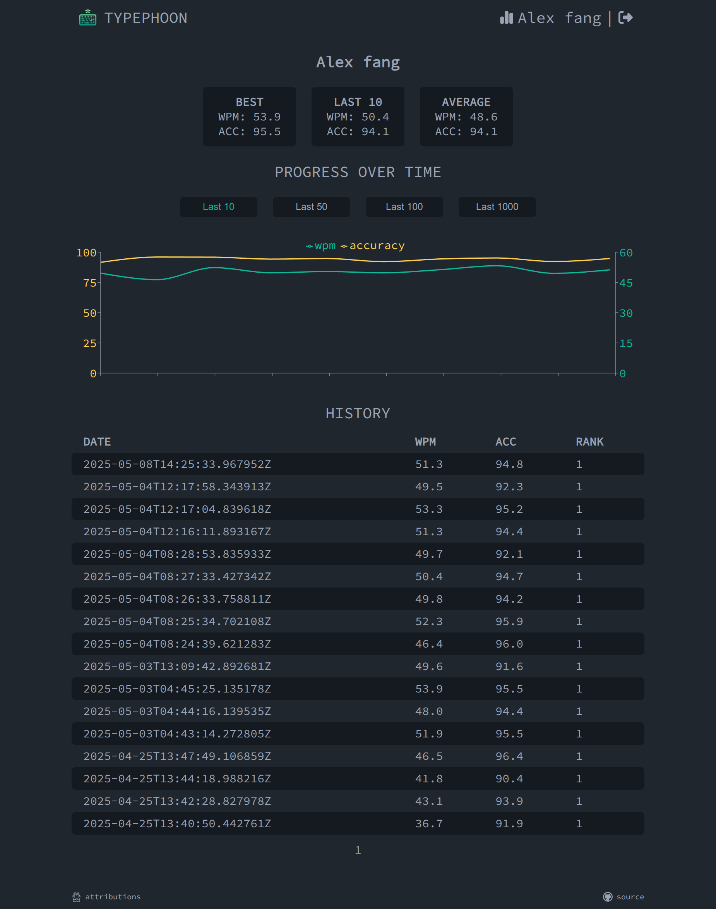

# Typephoon Frontend



## About
Typephoon is a real-time multiplayer typing game with a clean, 
minimalistic interface inspired by [monkeytype](https://monkeytype.com/). 
Challenge your friends or other players online, track your typing progress over time.

## Features
- Multi-player gameplay
- Minimalistic design inspired by monkeytype
- Player history / progress tracking
- Login with google (oauth2)

## Previews
### Multi-player gameplay
https://github.com/user-attachments/assets/8d2cd119-49a7-4dac-9afd-0c92e0722c5f

### Player history / progress tracking


## Build
For project architecture details, please refer to the [Build Section](https://github.com/AlexFangSW/Typephoon_api/blob/master/doc/build.md) in the backend repository
### Install dependencies
```
npm i
```

### Start treafik (gateway for local development)
Update the enviroment variable `FRONTEND_HOST` and `BACKEND_HOST`
in [compose.yaml](./compose.yaml) to your hosts IP.
```
docker compose up -d
```
Gateway is served at http://localhost:9090, redirects `/api/v1/*` to backend  
See how to start backend [here](https://github.com/AlexFangSW/Typephoon_api/blob/master/doc/build.md#start-for-frontend-development)  
You will need to clone the [backend repository](https://github.com/AlexFangSW/Typephoon_api)

### Run
```
npm run dev
```
## Related Project
- [Typephoon Backend](https://github.com/AlexFangSW/Typephoon_api)
