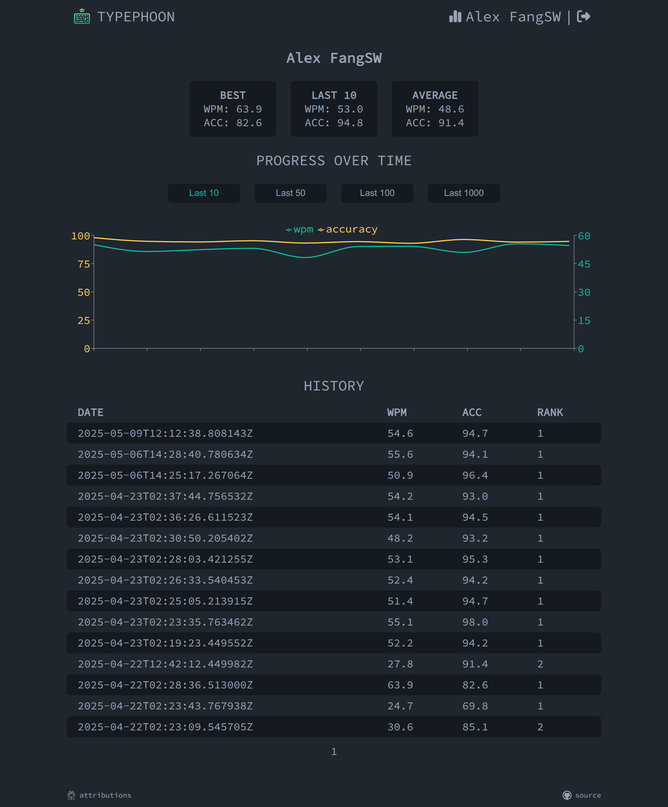

# Typephoon Frontend


## About
Typephoon is a real-time multiplayer typing game with a clean, 
minimalistic interface inspired by [monkeytype](https://monkeytype.com/). 
Challenge your friends or other players online, track your typing progress over time.

## Features
- Multi-player gameplay
- Minimalistic design inspired by monkeytype
- Player history / progress tracking
- Login with google (oauth2)

## Previews
### Multi-player gameplay
https://github.com/user-attachments/assets/8d2cd119-49a7-4dac-9afd-0c92e0722c5f

### Player history / progress tracking


## Build
For project architecture details, please refer to the [Build Section](https://github.com/AlexFangSW/Typephoon_api/blob/master/doc/build.md) in the backend repository
### Install dependencies
```
npm i
```
### Start treafik (gateway for local development)
```
docker compose up -d
```
### Run
```
npm run dev
```
## Related Project
- [Typephoon Backend](https://github.com/AlexFangSW/Typephoon_api)
