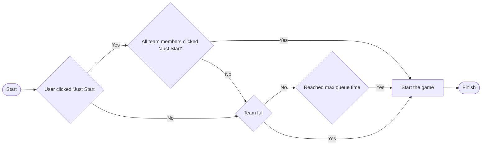
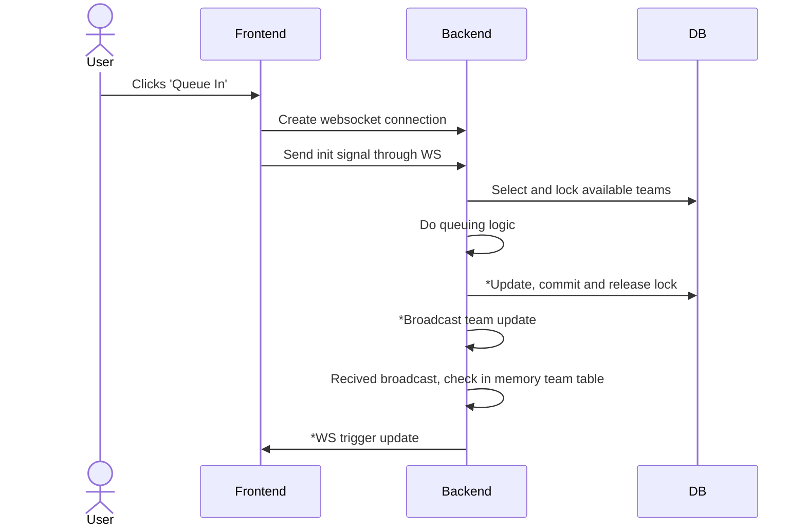

# Lobby (multi)
## Start logic
State machine

## Queue In

### Explanation
- Update, commit and release lock: Updates team data in DB as well as in memory team table
- Broadcast team update: Sends broadcast to all servers
- WS trigger update: Triggers frontend to fetch updated team data from an API, this includes all users in the same team.

## WS payload definition
TABLE
