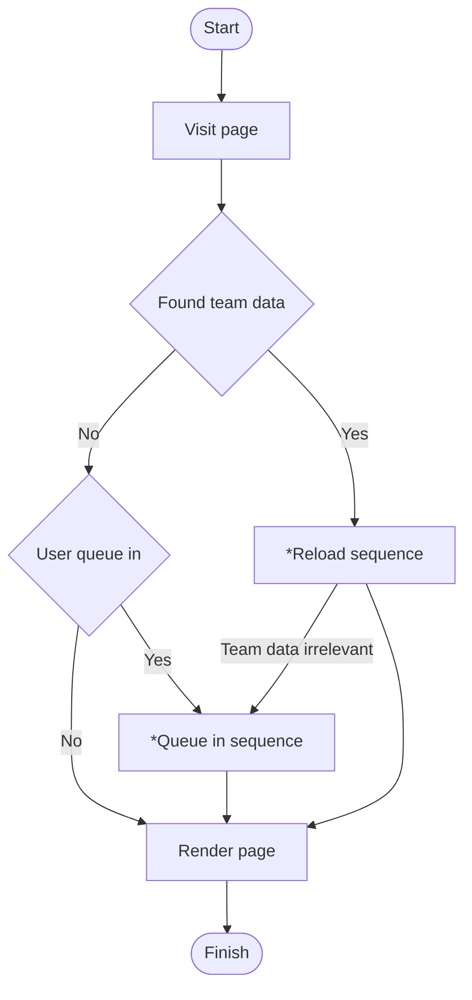
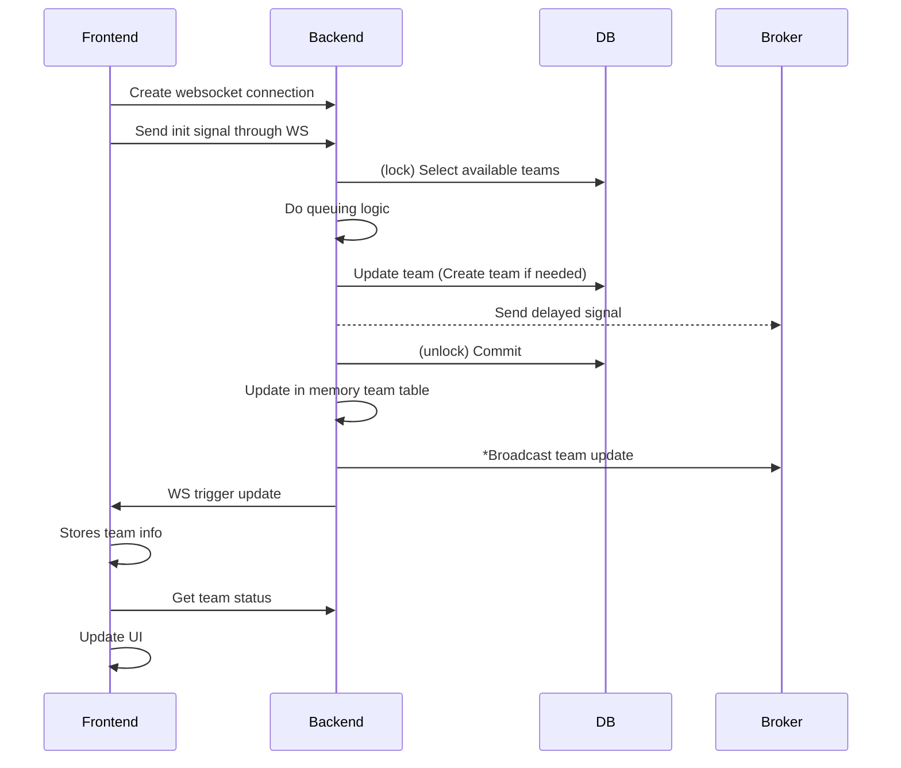
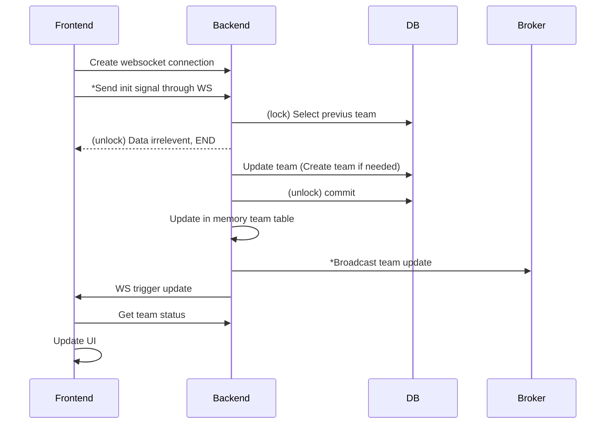
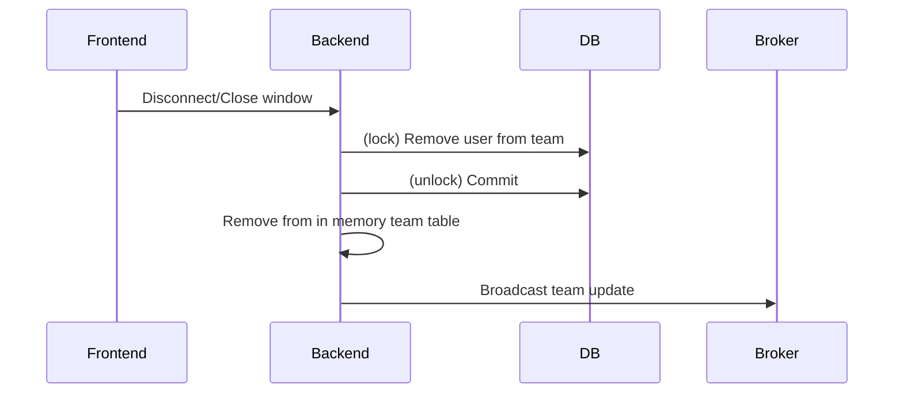

# Lobby (Multi player)
## On page load

> For actions with "*", please refer to sequence diagrams below

## Queue in sequence

### Explanation
- Broadcast team update: 
    - Sends broadcast to all servers
    - Upon receiving broadcast, servers will then send a update trigger through WS to notify all team members found in the in memory team table

## Reload sequence

### Explanation
- Send init signal through WS: This contains team data found on the client side, the client might be able to join the original team
- Broadcast team update: 
    - Sends broadcast to all servers
    - Upon receiving broadcast, servers will then send a update trigger through WS to notify all team members found in the in memory team table

## After page load
- Listen to websocket event
- Update count down timer for max queue time
    - The client fetches the current count down time from the server periodically (**Polling**)
    - The server gets the team's create timestamp and returns the current count down seconds
        - Create timestamp might be stored in a external cache
    - The client counts the delay, adjusts the timer then update locally

## On client disconnect

## Ghost team
If all team members are disconnected, the team is deleted.
- This is performed by the server that removes the last team member

## Start logic
The game will start if one of the requirements are met
- Team full
- Reached max queue time
- All users clicked "Just start"

## Start logic detail
Setting team status to 'started' will be done by some other service.
It will also send a 'Start game' signal.

### Team full
When the **last** user is assigned to the team
- The server that made that action will send a delayed signal to the broker
- The broker then broadcasts to all the servers
- Update team status in DB to 'started'
- Servers received the signal will then notify frontend to redirect users to the typing page where the game will take place.
- All cache related to "lobby" will be cleared

### Reached max queue time
When the **first** user is assigned to the team
- The server that made that action will send a delayed signal to the broker (Wait for max queue time)
- The broker then broadcasts to all the servers
- Update team status in DB to 'started'
- Servers received the signal will then notify frontend to redirect users to the typing page where the game will take place.
- All cache related to "lobby" will be cleared

### All users clicked "Just start"
When a user clicks 'Just start'
- The user is added to cache
- If all team members are in included in the cache, a delayed signal is sent to to broker
- The broker then broadcasts to all the servers
- Update team status in DB to 'started'
- Servers received the signal will then notify frontend to redirect users to the typing page where the game will take place.
- All cache related to "lobby" will be cleared
