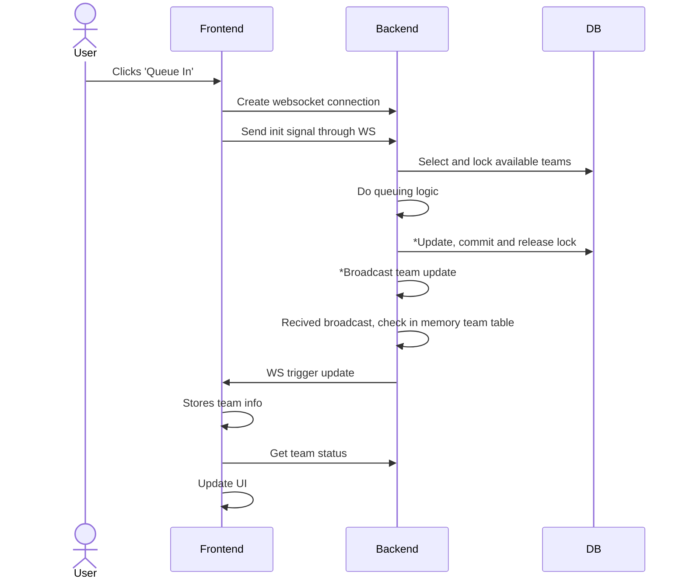
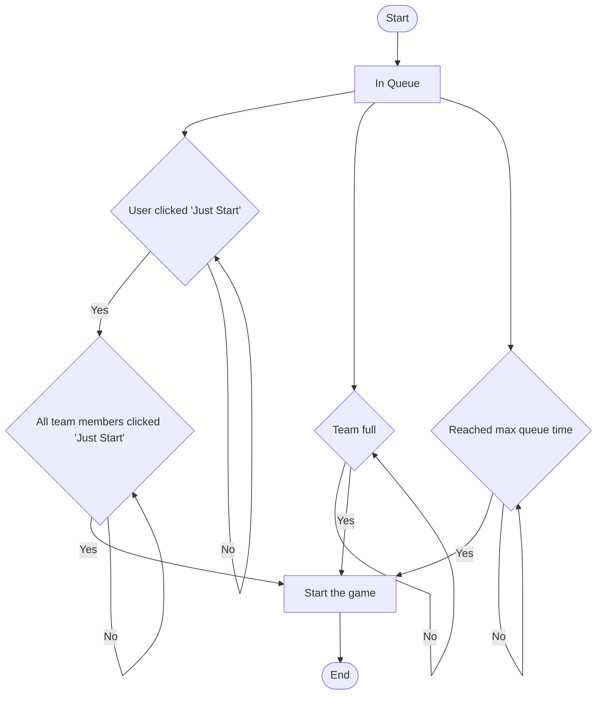

# Lobby (Multi player)
## Queue In

### Explanation
- Update, commit and release lock: Updates team data in DB as well as in memory team table
- Broadcast team update: Sends broadcast to all servers, every server has a in memory team table

### Reload page

## Start logic

