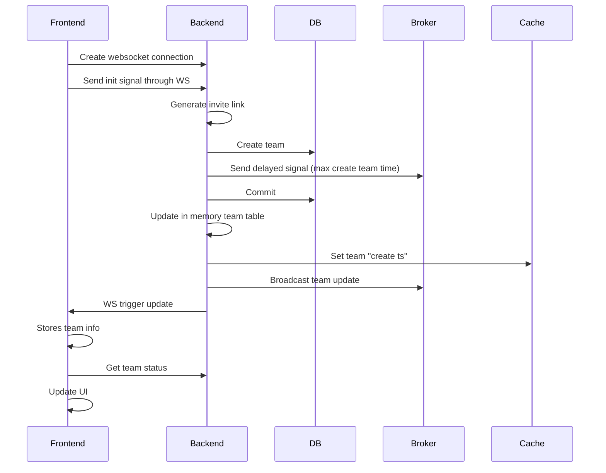
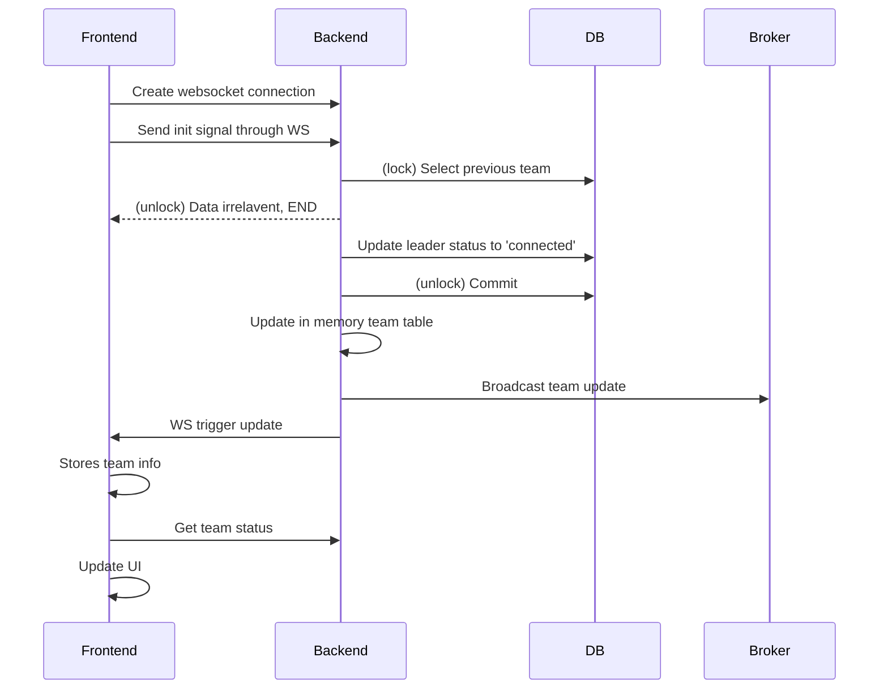
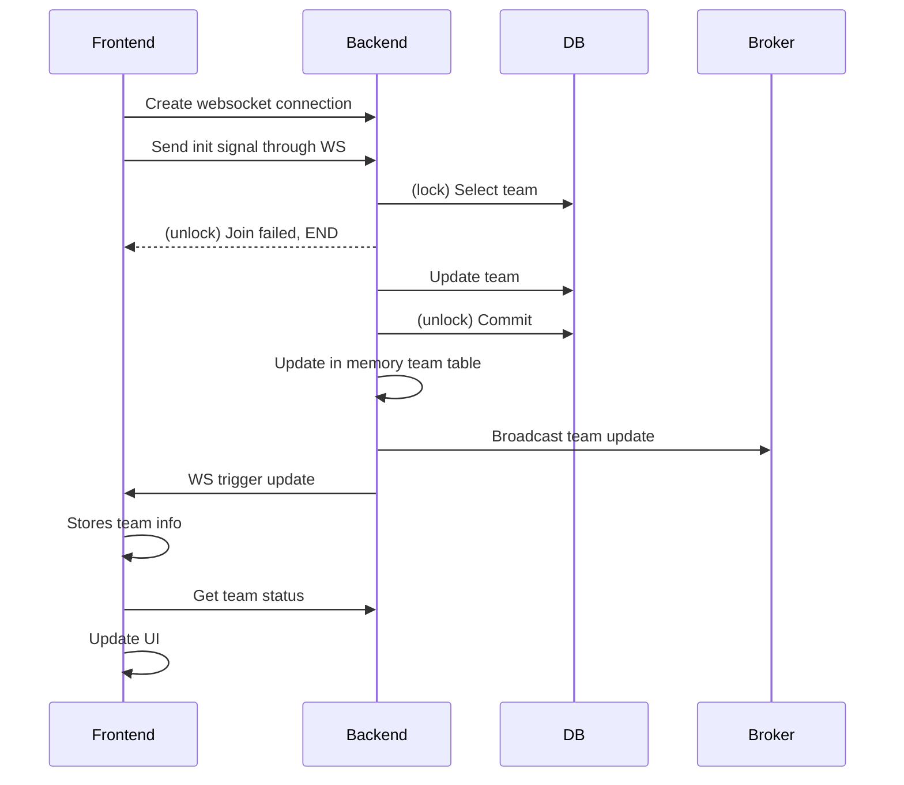
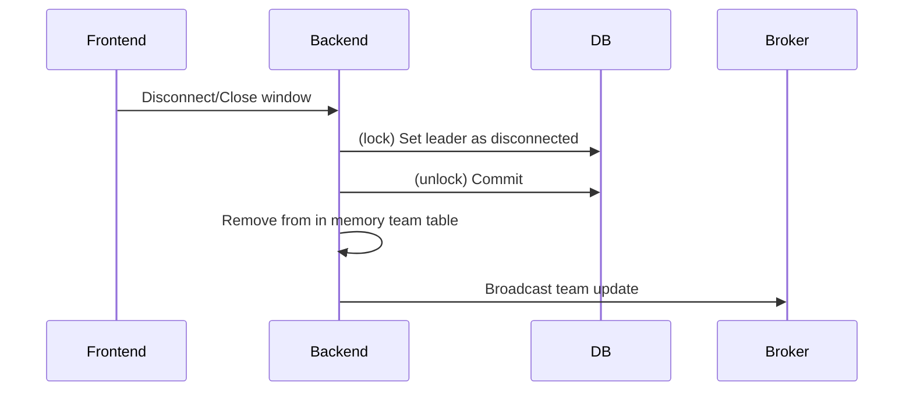
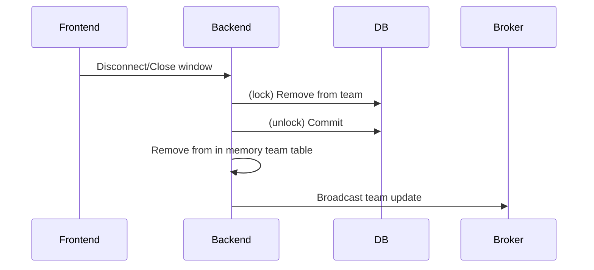
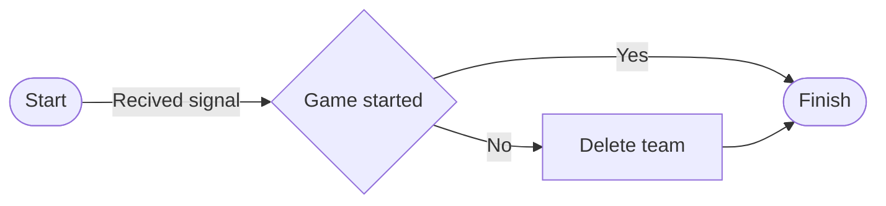

# Lobby (Team)
## On page load

> For actions with "*", please refer to sequence diagrams below

## Create team sequence

## (Leader) Reload sequence

## Join team sequence

## Leader disconnect

## Member disconnect

## After page load
- Listen to websocket event
- Update count down timer for max create team time
    - The client fetches the current count down time from the server periodically (**Polling**)
    - The server gets the team's create timestamp and returns the current count down seconds
        - Create timestamp might be stored in a external cache
    - The client counts the delay, adjusts the timer then update locally

## Janitor
A delayed signal is sent to the broker on team creation.
When the "janitor" receives the signal, it will determine if the team should be deleted.

## Start logic
- When the leader clicks 'Start'

## Start logic detail
When the leader clicks 'Start'
- The server sends a delayed signal to the broker
- The broker then broadcasts to all the servers
- Update team status in DB to 'started'
- Servers received the signal will then notify frontend to redirect users to the typing page where the game will take place.
- All cache related to "lobby" will be cleared
