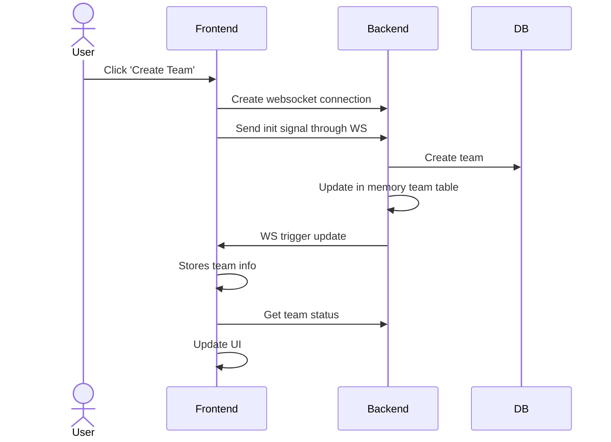
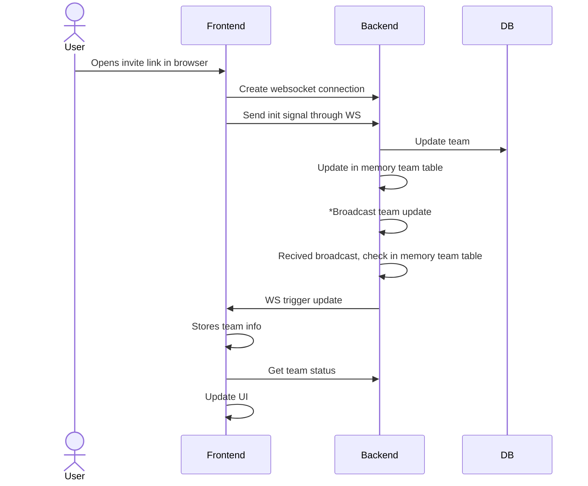
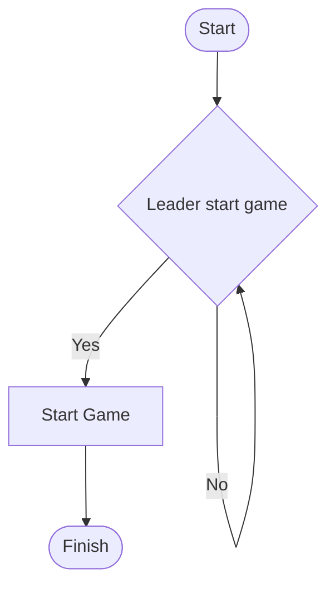

# Lobby (Team)
## Leader creates team

## Join team via invite link

### Explanation
- Broadcast team update: Sends broadcast to all servers, every server has a in memory team table

## Start logic

