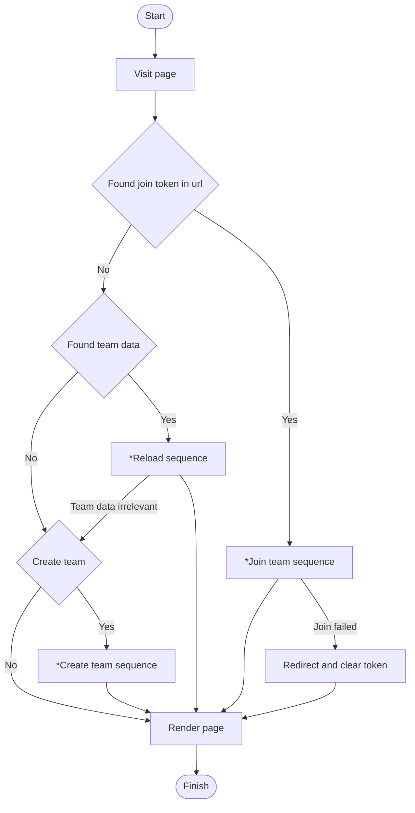

# Lobby (Team)
## On page load

> For actions with "*", please refer to sequence diagrams below

## Create team sequence
```mermaid
```

## (Leader) Reload sequence
```mermaid
```

## Join team sequence
```mermaid
```

## Leader disconnect
XXX
## Member disconnect
XXX

## After page load

## Janitor
A delayed signal is sent to the broker on team creation.
When the "janitor" receives the signal, it will determine if the team should be deleted.
```mermaid
flowchart LR
    start([Start])
    gameStarted{"Game started"}
    delete["Delete team"]
    finish([Finish])
    
    start-- Recived signal -->gameStarted
    gameStarted-- Yes -->finish
    gameStarted-- No -->delete
    delete-->finish
```


## Start logic

## Start logic detail
